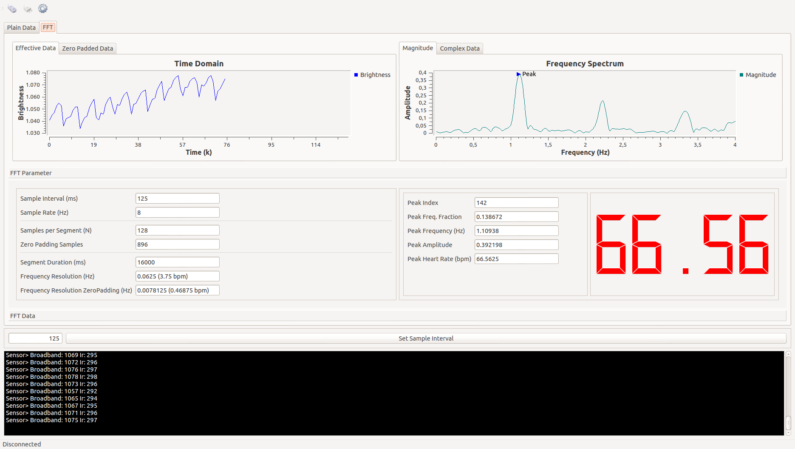

### Heart Rate Monitor

#### Abstract
The aim of this project is to build a heart rate monitor. There are already a lot of devices commercially available which measure the heart rate. However, the internal functionality of these devices is not exposed to the user, so there cannot be made any statements about their precision and the quality of the results. Additionally, most devices need to be worn on the users chest or the user must place his finger on it.

